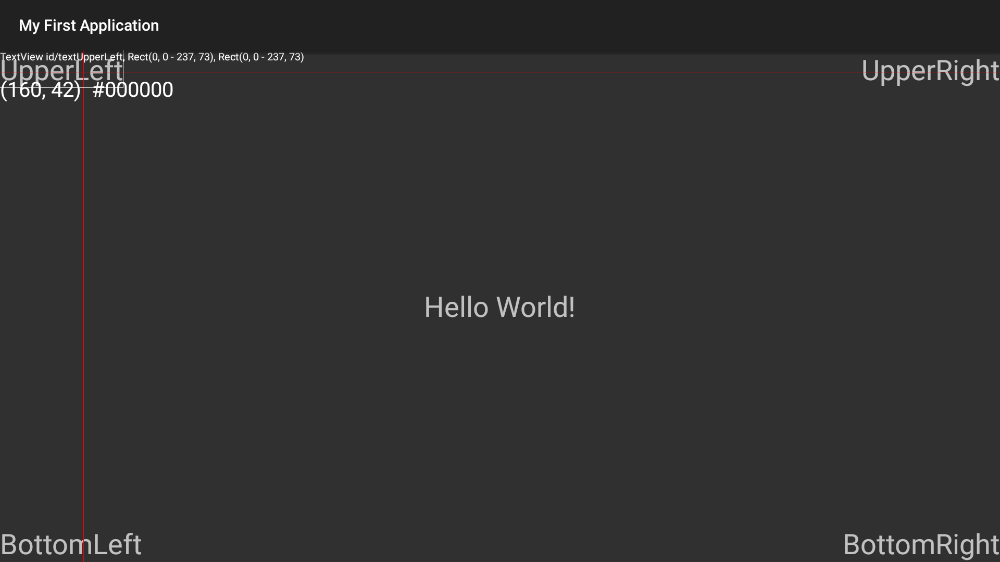

# ViewDebugTool

一个 Android TV / 手机应用的 View 层级调试工具，可在运行时通过遥控器（或 adb）操控十字光标、定位并高亮任意 View、查看其类名/ID/坐标，以及查看可获焦点的View.

## 集成方法

让需要调试的 Activity 继承 `ViewDebugToolBaseActivity`；如果项目中已有 Activity 公共基类，则让 `ViewDebugToolBaseActivity` 居中继承即可：

```
YourActivity → ViewDebugToolBaseActivity → (原有公共基类) → Activity
```

## 该工具的运行效果如下


## 启动工具

工具默认隐藏，按以下任意一组按键序列激活：

| 序列 | 按键 |
|------|------|
| 数字键 | `9` → `5` → `2` → `7` |
| 频道键 | 频道上 → 频道下 → 频道下 → 频道上 |

激活后屏幕上会出现红色十字光标；再次按 `返回键` 退出工具。

## 使用说明

### 光标控制

按1-6改变光标移动步长(数字越大移动步长越大), 按0让光标回到屏幕中心位置.

屏幕左上角实时显示光标坐标 `(x, y)` 以及该像素点的颜色值（十六进制 `#RRGGBB`）。

### View 检查

| 按键 | 功能                                                      |
|------|---------------------------------------------------------|
| 确定键（DPAD_CENTER）| 高亮光标处最顶层的 View，显示类名、资源 ID、View矩形的相对/绝对坐标                |
| 再次按确定键 | 依次向上遍历父 View, 显示父View的信息                                |
| 高亮 View 后长按方向键 | 显示 Framework API `focusSearch()` 找到的该方向下一个可获焦 View（蓝色框） |
| 松开方向键 | 清除可获焦 View 的高亮                                          |
| 返回键（高亮状态下）| 清除当前View高亮，回到光标模式                                       |
| 返回键（光标模式下）| 退出调试工具                                                  |
| 菜单键 | 重新抓取屏幕像素（用于更新颜色显示）                                      |

### 触摸支持

在手机上也可以直接触摸屏幕移动光标，抬手时自动显示触点处的 View 信息。

## System Properties 配置

可通过 Android System Properties 在运行时动态调整显示样式（无需重新编译）：

| 属性键 | 含义 | 默认值 |
|--------|------|--------|
| `debug.view_debugger.color` | 选中 View 的高亮颜色（ARGB 整数）| `WHITE` |
| `debug.view_debugger.focus_color` | 焦点候选 View 的高亮颜色（ARGB 整数）| `BLUE` |
| `debug.view_debugger.text_size` | View 信息文字大小（px）| `20` |

通过 adb 设置示例：

```bash
adb shell setprop debug.view_debugger.color 0xFFFF0000   # 红色
adb shell setprop debug.view_debugger.focus_color 0xFF00FF00  # 绿色
adb shell setprop debug.view_debugger.text_size 30
```

## adb 模拟遥控器按键

在手机或模拟器上调试时，可用 adb 模拟遥控器：

```bash
adb shell input keyevent <keycode>
```

常用 keycode：

| 按键 | keycode |
|------|---------|
| 方向上 | 19 |
| 方向下 | 20 |
| 方向左 | 21 |
| 方向右 | 22 |
| 确定 | 23 |
| 返回 | 4 |
| 菜单 | 82 |
| 频道上 | 166 |
| 频道下 | 167 |
| 数字 0–9 | 7–16 |
